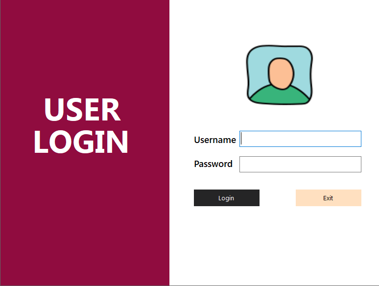
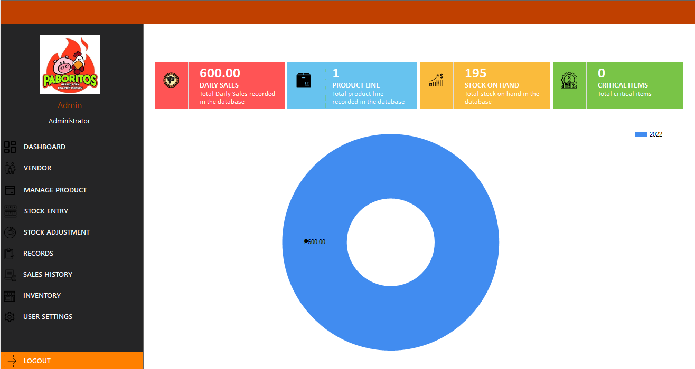
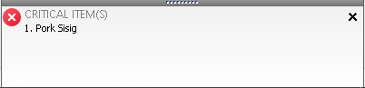
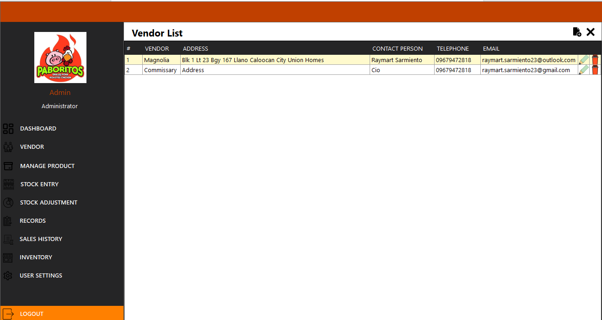
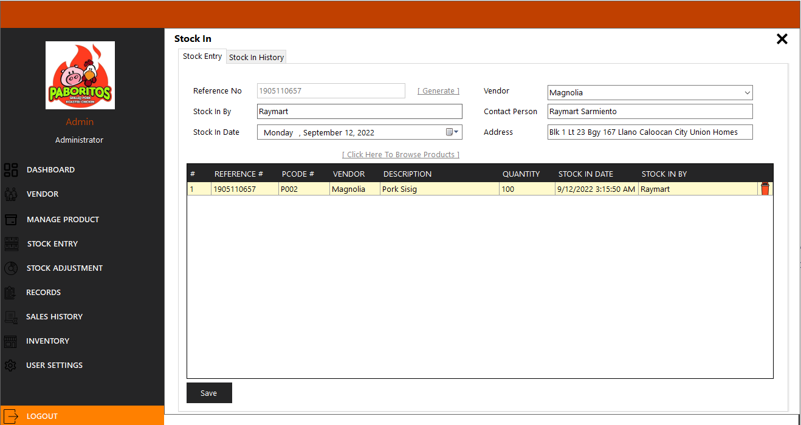

# P.O.S (Point Sale System)

P.O.S System is one of the ruling software that businesses are using. One of the focal objectives of this software is to let the business owner track the sales, flow of inventory/stocks, and other information that will help the business owner not to do these things manually.

The sole purpose of this is to document the software that I developed for the client.

## Client’s Request

- The client wanted to have an inventory system where he can track the numbers of stocks from the commissary and to his outlet
- Wanted to see the number of sales per day, per year, and custom dates that he wanted
- Wanted to have one software for admin and cashiers
- Wanted to see every cashier's details such as sales per day, how much sales, and most important how many stocks are used with every transaction.

## Software Features

- SQL Supported (Microsoft SQL Server)
- Configurable (Config file is available to change your connection settings to SQL)
- Password is hashed (Secured)
- Secured for potential SQL Injection
- Account for user and admin are fully controlled by super admin

## UI Sample

### Note:

The client does not want me to spend much time with the design. All the designs you are going to see are simple because I am more focused with the functionality of the project.

## Login Form

Depending on the role it will automatically log you on to your respective tools.

## Admin / Super Admin

### Note:

Admin and Super Admin access are all the same except that Super Admin is the only one who can access the commissary inventory.

## Dashboard

### Function:

- This will show you the total sales in a day which is the day you are looking the dashboard.
- This will show you the products count that are available to sell.
- This will show you the total stocks we have in this outlet.
- This will show you how many critical items or the items that needs to be re stocked.
- This will also show you the chart of sales in a yearly basis.
- You will get a notification if the product needs to be re stocked which will show at the bottom right of your screen and this is the sample:

## Vendor

### Function:

- This will show you all the available vendors.
- You can add vendors by typing their information.
- You can edit a vendor.
- You can delete a vendor.

## Manage Product

### Function:

- The admin doesn’t have much functionality here because all the products that will show here are from the commissary records that is accessible only by Super Administrator.
- In this form it will only show you all the lists of the product and you are also allowed to search if there is a lot.
- Re–Order means it is the level or if the stocks hit that quantity or below it will be considered critical item or an item that needs a stock. Which will show in the dashboard or notifications.

## Stock Entry

### Function:

- You can add stocks here from outlet.
- You can select a vendor where the stock will come from.
- You must generate a reference # about this stock event so that it will be shown in Stock In History after you finished stocking in.
